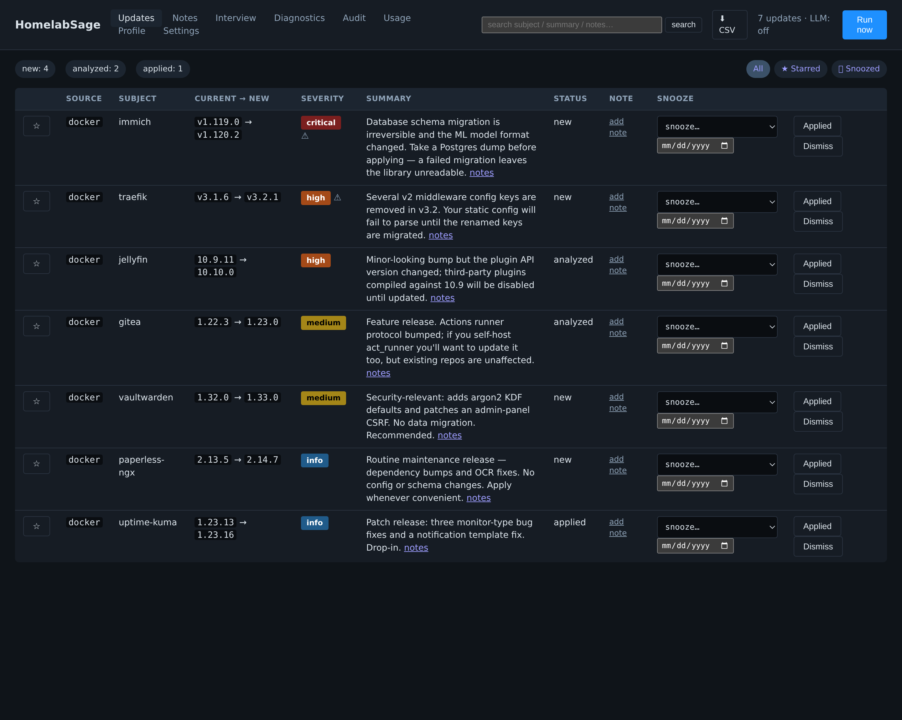
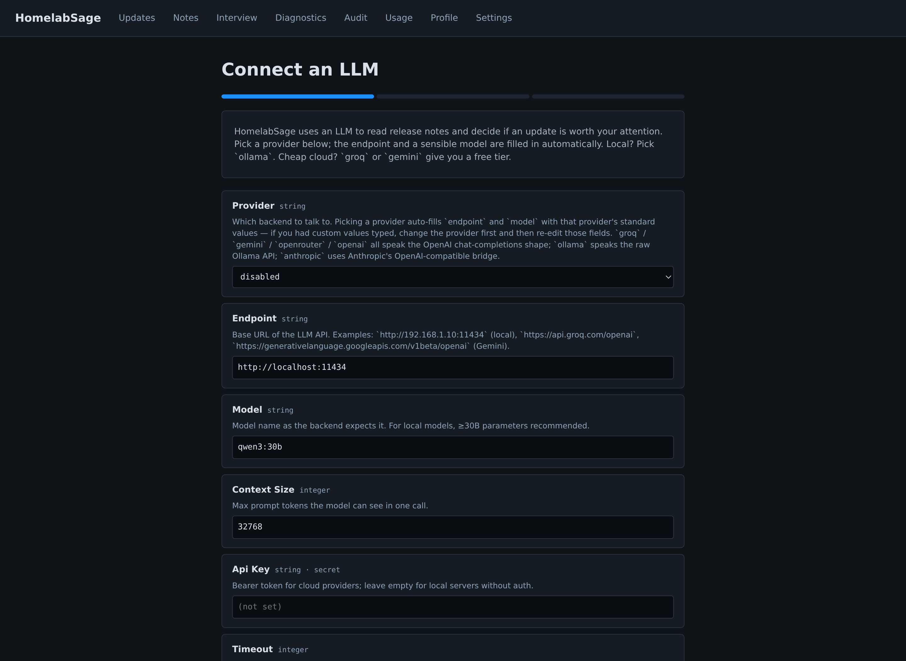
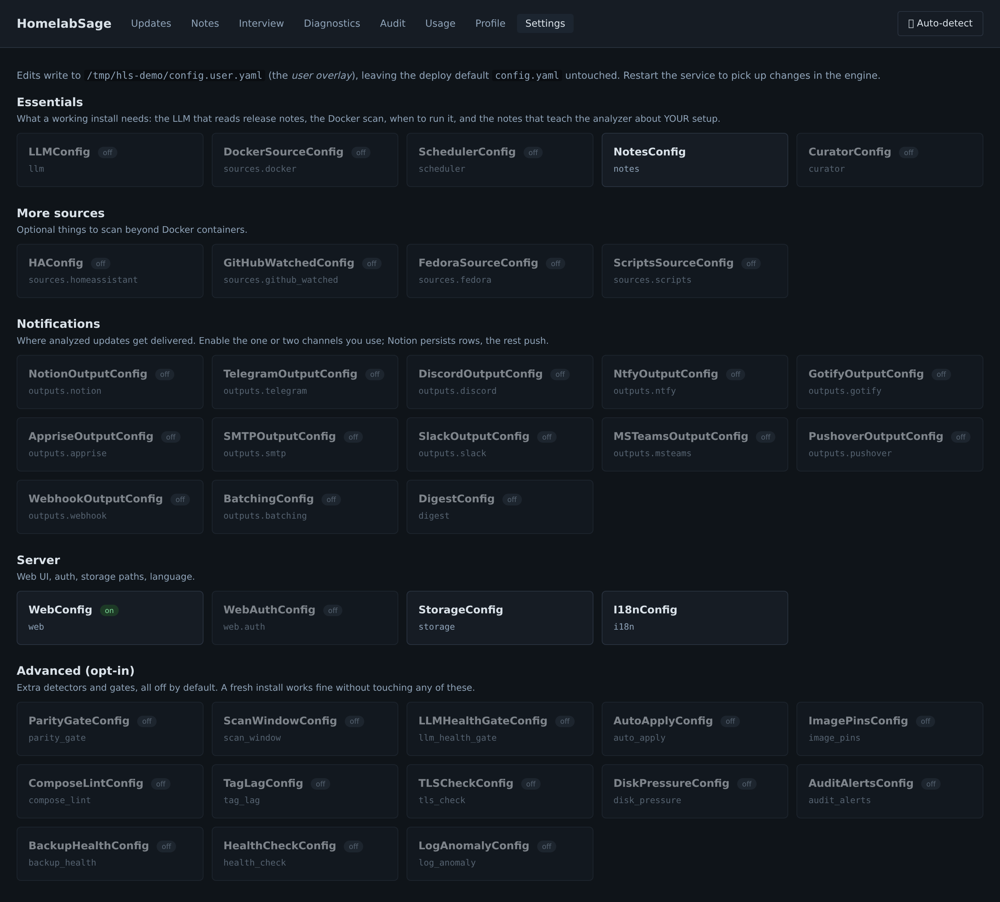

<p align="center">
  
</p>

<h1 align="center">HomelabSage</h1>

<p align="center">
  <a href="https://github.com/jlp9989-sudo/HomelabSage/actions/workflows/ci.yml"></a>
  <a href="LICENSE"></a>
  <a href="#"></a>
  <a href="pyproject.toml"></a>
</p>

**AI-powered homelab analyzer, update tracker and improvement advisor.**

Watches your stack (Docker containers, Home Assistant, Linux packages, firmware, news feeds, RSS) and uses a **local LLM** to tell you, for each update:

- Whether there are **breaking changes** that affect *your* current config.
- Whether parts of your **setup are obsolete** because the new version brings them built-in.
- Whether there are **new features relevant to your homelab**.
- A short, structured summary so you don't have to read raw release notes.

The LLM doesn't analyze updates in a vacuum — you can point it at your own `notes/` directory (markdown), and it pulls in only the sections that match the update subject. That's how it knows "your Elasticsearch is versionlocked on 8.x because of RAGFlow" before recommending an upgrade.

> Status: **beta**, in active development. Docker is the primary source; Home Assistant, Fedora-over-SSH, and arbitrary watched GitHub/Codeberg repos are implemented and tested.

---

## Screenshots

### Dashboard — every analyzed update at a glance

The list groups by severity (critical / high / medium / info), with an explicit "action required" flag on rows that have a migration step, a deprecated env var, or anything else the LLM thinks you should look at before pulling the image.



### First-run wizard — three steps to a working install

Provider dropdown auto-fills the endpoint and a sensible model on change. Pick Groq or Gemini for a free cloud tier, Ollama for fully local, OpenAI / Anthropic / OpenRouter for everything else.



### Settings — schema-driven, no YAML editing

Every block of the config is a card. Open a block to edit individual fields with type-aware widgets (cron preset picker, IANA timezone picker, path-with-resolved-hint), revert overrides field-by-field, and run a connection-test against the external service without leaving the page.



---

## Quick start

Two minutes from clone to web UI. Free cloud LLM, no GPU required:

```bash
mkdir -p notes data
cat > config.yaml <<'EOF'
llm:
  provider: openai
  endpoint: https://generativelanguage.googleapis.com/v1beta/openai
  model: gemini-3.1-flash-lite           # best free cloud pick in our benchmark (see below)
  api_key: "PASTE_YOUR_AI_STUDIO_KEY"    # free at aistudio.google.com
sources:
  docker:
    enabled: true
notes:
  notes_dir: /app/notes
storage:
  database_path: /app/data/state.sqlite
EOF

docker run --rm -d --name homelabsage \
  -p 8000:8000 \
  -v /var/run/docker.sock:/var/run/docker.sock:ro \
  -v "$PWD/config.yaml:/app/config.yaml:ro" \
  -v "$PWD/notes:/app/notes" \
  -v "$PWD/data:/app/data" \
  ghcr.io/jlp9989-sudo/homelabsage:latest serve

# 1. Let the curator write a note about a few of your containers — this is
#    what separates HomelabSage from a plain update notifier: the analyzer
#    will read these notes and judge updates against YOUR setup.
docker exec homelabsage homelabsage curate --discover --limit 3

# 2. Scan now (instead of waiting for the 09:00 cron)
docker exec homelabsage homelabsage check
```

Open <http://localhost:8000>. You'll see one row per detected update, each with severity, summary, and a recommended action — informed by the notes the curator just wrote. Edit those notes (or add your own `.md` files in `./notes`) and the next scan uses them as context. Then visit `/autoconfig` — HomelabSage inspects your host (compose paths, docker root dir, Unraid parity) and proposes the matching settings for one-click review.

For a real deploy (compose, scheduled scans, Notion/Telegram outputs, local LLM), see [Install](#install) and [Configuration](#configuration).

---

## Why

Most release-note watchers (Diun, WatchTower, Renovate) tell you *that* there is a new version. None of them read the changelog *and* your own constraints. HomelabSage is the missing layer that does both — see [Architecture](#architecture) for how the pieces fit.

---

## Features

- **Plugin-based sources.** One file = one source. Docker + Home Assistant + Fedora over SSH today; opt-in `watched_repos` plugin for arbitrary GitHub/Codeberg repos you run outside containers. See [docs/plugin-sdk.md](docs/plugin-sdk.md).
- **Auto-configuration.** `homelabsage autoconfig` (or the `/autoconfig` page) inspects your host — compose paths from container labels, the docker root dir, Unraid/mdraid parity — and proposes the matching settings with evidence. You review, tick, apply; your own entries always survive the merge.
- **Cross-signal analysis.** The analyzer doesn't just read changelogs: it warns when a pull *won't fit* in your free disk space, when the container is *already unstable* (flapping / OOM-killed / unhealthy) before you touch it, and when you're about to apply a breaking change *on stale backups* (restic/borg/kopia probe).
- **Audit + doctor.** `/audit` is a prioritized report of everything wrong that isn't an update (CVEs, abandoned upstreams, flapping containers, exposed ports, env-file permissions, disk pressure…), with a mute list and history diffing. `homelabsage doctor` bundles the health probes into one exit-code-friendly command.
- **MCP server.** `/mcp` speaks JSON-RPC with 50 tools, so Claude Code / Cursor / any MCP client can query updates, run audits, snooze rows, or pull rollback recipes.
- **Local LLM by default.** Ollama-compatible API; works with [Ollama](https://ollama.com), [llama.cpp server](https://github.com/ggml-org/llama.cpp), LM Studio, or any OpenAI-compat endpoint. Falls back to OpenAI / Anthropic / Groq / Gemini / OpenRouter if you really want to.
- **Tolerant JSON parser.** Strips markdown fences, surrounding prose, accepts case-insensitive severity, falls back to a `summary`-only best-effort when the model bends the schema. Removes inline `<think>…</think>` blocks from reasoning models.
- **Your notes are the secret sauce.** Point `notes.notes_dir` at a folder of `.md` files (your CLAUDE.md, ARCHITECTURE.md, OPS.md, etc). For each update, only the sections that mention the subject get injected — no token bloat.
- **Curator auto-writes notes for you.** `homelabsage curate --discover` walks every running container and produces `notes/<service>.md` from `docker inspect` + the upstream README + container logs + your existing notes. `--system` adds a `notes/system.md` from host probes (kernel, docker info, GPUs, ZFS, Unraid).
- **Rich update context.** Per Update we attach: `repo_health` (alive / stale / abandoned via GitHub pushed_at), `alternatives` (LSIO + Docker Hub cross-reference for better-maintained substitutes), `orphan_since_days` for stopped containers, `cve` (optional Trivy/Grype scan), `cascade.depends_on_me` (compose graph), `image_size_growth` (concrete bloatware signal), `puid_pgid` (LSIO permission hint).
- **Webhook notifications.** Telegram, Discord, Ntfy, Gotify out of the box — same severity gate, same idempotent shape.
- **Weekly digest.** Sunday-09:00 rollup of severity counts, top items, orphans, abandoned upstreams. Posts to every enabled channel and pins to `notes/digest.md` so next week's analyses see last week's misses as context. Backstop for missed real-time pings.
- **CSI mode.** `homelabsage csi <container>` — post-mortem assistant: pulls logs since the last detected update, filters to ERROR/WARN/FATAL, cross-references your notes, asks the LLM what likely broke and what to try.
- **On-demand URL analysis.** `homelabsage analyse https://github.com/owner/repo` — same analyzer, no scan required.
- **"What I see" diagnostics page.** Per-container verdict at `/diagnostics`: tracked / floating_tag / no_repo / no_version / skipped_by_rule.
- **Parity-aware notification gate.** On Unraid + plain mdraid, silences push channels while a parity check / resync is running. Queues skipped notifications and auto-flushes them when the gate clears (no manual catch-up needed; `homelabsage notify-pending` still available for edge cases).
- **Web UI with editor.** Read the analyzed list, edit notes from the browser, configure every plugin from the `/settings` schema-driven forms (HTMX-style, no SPA). Three-step first-run wizard. HTTP Basic Auth optional but recommended.
- **Path-traversal safe.** Notes editor refuses `..` and non-`.md`/`.txt` extensions.
- **Stable IDs.** `source:subject:new_version` — re-running a scan doesn't create duplicates.
- **Heartbeat-friendly.** Pings an Uptime Kuma push monitor (or any URL) after each successful scan.
- **Sanitised export.** `homelabsage export --redact` produces a single-file dump of compose configs + container env + recent analyses with IPs / hostnames / credentials scrubbed — ready to paste into a GitHub issue.

---

## Architecture

One plugin = one file, one output = one file. ~31k lines of Python, ~1,700 tests, no SPA, no ORM.

```
   ┌──────────────────────────────────────────────────────────────┐
   │  Plugins         scan() → list[Update]                       │
   │  ────────                                                    │
   │   docker         containers → OCI label → GitHub releases    │
   │   homeassistant  /api/config + HACS + Supervisor add-ons     │
   │   fedora         dnf check-update over SSH                   │
   │   github_watched arbitrary GitHub/Codeberg repos (opt-in)    │
   └──────────────────────────────────────────────────────────────┘
                                  │
                                  ▼
   ┌──────────────────────────────────────────────────────────────┐
   │  Engine          for each Update:                            │
   │  ──────                                                      │
   │    1. fetch release notes (full span between your version    │
   │       and the candidate, not just the latest)                │
   │    2. cross-signals — pins, will-it-fit, backup freshness    │
   │    3. NotesProvider — pull matching sections from your docs  │
   │    4. LLM analyze (only the prompt rules whose context       │
   │       signals are present get sent)                          │
   │    5. persist (SQLite) → route to outputs (severity gates,   │
   │       quiet hours, parity gate, low-severity batching)       │
   └──────────────────────────────────────────────────────────────┘
                                  │
                                  ▼
   ┌──────────────────────────────────────────────────────────────┐
   │  Outputs                                                     │
   │  ───────                                                     │
   │   Web UI       FastAPI + Jinja2 (HTTP Basic Auth optional)   │
   │   Notion       database row per analyzed update              │
   │   Push         Telegram · Discord · Ntfy · Gotify · Slack    │
   │                · MS Teams · Pushover · SMTP · Apprise ·      │
   │                generic webhook — all severity-gated          │
   │   Heartbeat    Uptime Kuma / Healthchecks ping after each run│
   └──────────────────────────────────────────────────────────────┘
```

The **curator** (`homelabsage curate`) is a sibling pipeline that writes the notes the analyzer reads — see [ROADMAP.md](ROADMAP.md) → v0.4.

---

## Install

### Docker Compose (recommended)

```yaml
services:
  homelabsage:
    image: ghcr.io/jlp9989-sudo/homelabsage:latest
    container_name: homelabsage
    restart: unless-stopped
    ports:
      - "8000:8000"
    volumes:
      - /var/run/docker.sock:/var/run/docker.sock:ro
      - ./config.yaml:/app/config.yaml:ro
      - ./.env:/app/.env:ro
      - ./notes:/app/notes        # optional — your markdown notes
      - homelabsage-data:/data
    environment:
      TZ: Europe/Madrid

volumes:
  homelabsage-data:
```

Then:

```bash
cp config.example.yaml config.yaml      # edit
cp .env.example .env                    # edit (LLM endpoint, tokens)
docker compose up -d
```

Open `http://<host>:8000` (or wherever you bound it).

### Unraid

There's an Unraid Community Apps template under `unraid/` (planned). Until then, the Docker Compose route above works fine via [Dockge](https://github.com/louislam/dockge) or `User Scripts`.

### From source

```bash
git clone https://github.com/jlp9989-sudo/HomelabSage
cd HomelabSage
pip install -e ".[dev]"

cp config.example.yaml config.yaml      # edit
homelabsage check                       # one-shot scan
homelabsage serve                       # web UI + scheduler
```

Python ≥ 3.11.

---

## Configuration

`config.yaml` is the only required file. The example is heavily commented — read it. Highlights:

```yaml
llm:
  provider: ollama                       # ollama | openai | anthropic | disabled
  endpoint: http://localhost:11434       # or your llama.cpp / LM Studio endpoint
  model: qwen3:30b                       # ≥30B parameters recommended for analysis
  context_size: 32768
  api_key: "${LLM_API_KEY:-}"            # only for openai/anthropic
  timeout: 180

sources:
  docker:
    enabled: true
    socket: /var/run/docker.sock
    overrides: {}                        # container_name → github owner/repo
    skip:
      - "^.*_(redis|valkey|postgres|mysql|mariadb|db)$"

  homeassistant:
    enabled: false
    url: http://homeassistant.local:8123
    token: "${HA_TOKEN:-}"
    include_hacs: true
    include_addons: true

outputs:
  notion:
    enabled: false
    api_key: "${NOTION_API_KEY:-}"
    database_id: "${NOTION_DB_INFRA_UPDATES:-}"
    write_policy: always                 # always | only_action_required
  telegram:
    enabled: false
    bot_token: "${TELEGRAM_BOT_TOKEN:-}"
    chat_id: "${TELEGRAM_CHAT_ID:-}"
    min_severity: high                   # critical | high | medium | info

scheduler:
  enabled: true
  cron: "0 9 * * *"
  timezone: Europe/Madrid
  heartbeat_url: "${HEARTBEAT_URL:-}"

web:
  enabled: true
  host: 0.0.0.0
  port: 8000
  auth:
    enabled: false                       # recommended: true if not loopback
    username: admin
    password: "${HOMELABSAGE_PASSWORD:-}"

notes:
  notes_dir: ./notes                     # folder of *.md files
  extra_docs: []                         # always-included (keep short)
  max_chars: 4000
```

Any `${VAR}` is expanded from the environment (or a `.env` file next to `config.yaml`). `${VAR:-default}` works.

### LLM provider setup

**Ollama (local):**

```yaml
llm:
  provider: ollama
  endpoint: http://192.168.1.10:11434
  model: qwen3:30b
```

The `ollama` provider speaks Ollama's **native API** (`POST /api/generate` with `format: json`) — use it only against an actual Ollama server.

**llama.cpp `llama-server` / LM Studio / vLLM / any OpenAI-compatible server (local, recommended):**

```yaml
llm:
  provider: openai
  endpoint: http://192.168.1.10:11434     # llama-server with an OpenAI-compat /v1
  model: Qwen3.6-35B-Abl
  # no api_key needed for a local server
```

These servers implement `/v1/chat/completions`, not Ollama's `/api/generate` — point them at the `openai` provider or every call 404s. (The endpoint may share Ollama's classic `:11434` port; what matters is the protocol, not the port.)

**OpenAI / Anthropic (cloud, fallback):**

```yaml
llm:
  provider: openai
  endpoint: https://api.openai.com
  model: gpt-4o-mini
  api_key: "${LLM_API_KEY}"
```

**Free cloud LLM tiers (OpenAI-compatible):**

No GPU at home? All three providers below expose an OpenAI-compatible Chat Completions API — only `endpoint`, `model` and `api_key` change. The default `0 9 * * *` scan cadence fits inside every free tier listed.

*Groq* — fastest free inference, generous daily quota:

```yaml
llm:
  provider: openai
  endpoint: https://api.groq.com/openai
  model: llama-3.3-70b-versatile     # check console.groq.com/docs/models for current ids
  api_key: "${LLM_API_KEY}"
```

*OpenRouter* — single account, 200+ models including free variants:

```yaml
llm:
  provider: openai
  endpoint: https://openrouter.ai/api
  model: meta-llama/llama-3.3-70b-instruct:free
  api_key: "${LLM_API_KEY}"
```

*Google Gemini* — Flash free tier (~1,500 req/day):

```yaml
llm:
  provider: openai
  endpoint: https://generativelanguage.googleapis.com/v1beta/openai
  model: gemini-2.0-flash
  api_key: "${LLM_API_KEY}"
```

> Tip: run `homelabsage check -v` once after switching to confirm the JSON schema parser is happy. Free models occasionally bend the schema; the tolerant parser handles most cases but `-v` will surface anything it had to fall back on.

**Disabled (no LLM, detection only):**

```yaml
llm:
  provider: disabled
```

Updates are still detected and stored. No `summary`, no `breaking_changes`, no `recommended_action`. Useful for first-run sanity checks.

### Tested models

The same prompt has been run head-to-head against several backends on a fixed set of 5 production containers (`a-eye`, `tintes`, `immich`, `n8n`, `FileBrowser-PNP`) with `--dry-run` from the curator — the most sensitive consumer of the prompt; the analyzer is more forgiving because it gets structured release notes. Results below are first-hand, not vendor blurbs.

**Curator quality** is a 1–5 score combining: (a) leads with the *why*, (b) surfaces non-obvious facts, (c) avoids restating `docker inspect`, (d) outputs clean Markdown (no leaked reasoning, no env-var dumps).
**Honesty** is whether rule 7 (`(no purpose stated yet — fill in)`) fires on a thin-context container instead of inventing a purpose.

| Model | Provider | Cost | Latency/note (5-container batch) | Curator quality | Honesty (rule 7) | Notes |
|---|---|---|---|---|---|---|
| **Qwen3.6-35B-Abl** (huihui_ai abliterated) | local llama.cpp (Vulkan / ROCm) | free, ~24 GiB VRAM warm | 5–8 s | **5/5** — uses `##` subsections, surfaces non-obvious facts (e.g. spotted the ImageGenius fork swapping `pgvecto.rs` for VectorChord, which neither commercial Gemini nor Llama picked up) | rule 7 rarely fires | the project's daily driver |
| **Qwen3.6-27B-Think** | local llama.cpp (Vulkan / ROCm) | free, ~18 GiB VRAM warm | ~20 s | **4/5** — almost as good as 35B-Abl, similar `## Section` structure; thinking phase eats latency without proportionate quality gain | rule 7 fires honestly on thin inputs (good signal) | reasoning content stays server-side; nothing leaks into the note |
| **Qwen3.5-4B-Compact** | local llama.cpp | free, ~3 GiB VRAM | ~6 s | **3/5** — punches above weight: caught the VectorChord switch and the openvino-variant detail on first pass. Hallucinates the purpose sentence ("Django web application for the tintes project") instead of firing rule 7. Some env-var bleed | rule 7 never fires | smallest model that's still useful. Tiny VRAM footprint — runs on a laptop |
| **Llama-3.3-70B-versatile** | Groq (free, OpenAI-compat) | free, ~1000 chat req/day | 1–2 s | **2/5** — flat prose, no subsections, **violates rule 3 most often** (cites `PYTHON_SHA256` verbatim, copies entire env vars into bullets) | rule 7 never fires | fastest. Watch the HTTP 429 on bursts of 5+ targets |
| **llama-3.1-8b-instant** | Groq (free) | free | ~1.3 s | **2/5** — same hallucination shape as the 70B sibling, just smaller. Still cites `PYTHON_SHA256`. Burns through Groq's per-minute quota quickly (hit 429 after 3 calls) | rule 7 never fires | only worth it for offline / one-shot curate on a single container |
| **openai/gpt-oss-20b** | Groq (free) | free | ~3 s when not throttled | **3/5** — when it works, fires rule 7 cleanly on thin inputs and stays terse. But rate-limits aggressively — 3 of 5 calls failed with 429 in the batch test | rule 7 fires honestly | unusable for `--discover` on a real stack until Groq raises the per-model RPM cap, or you add inter-request sleeps |
| **qwen/qwen3-32b** | Groq (free) | free | ~2 s when not throttled | **2/5** — produces the richest cloud note (caught VectorChord, distinguished image variants cleanly) **but leaks an unwrapped `<think>...</think>` block into the note body**. Would write reasoning trace to `notes/<service>.md` verbatim. 2 of 5 calls also 429'd | rule 7 never fires | **do not use until the curator strips `<think>` blocks** — open issue. Or use the Halo's Think model, which keeps reasoning server-side |
| **gemini-2.5-flash-lite** | Google AI Studio | free, ~1500 req/day | ~21 s | **2/5** — slower than the full `2.5-flash`, similar over-eagerness to dump env vars; mis-fires rule 7 the same way (writes fallback then keeps going). Hit one transient 503 in the batch | rule 7 occasionally | no quality advantage over `2.5-flash` at higher latency |
| **gemini-3.1-flash-lite** | Google AI Studio | free | **~1.4 s** | **4/5** — best cloud option tested. Concise prose, catches openvino variant, fires rule 7 cleanly on thin inputs. Closest match to local Qwen quality at cloud speed | rule 7 fires honestly | endpoint must end in `/v1beta/openai`. Free model id, no auth gymnastics |
| **gemini-2.5-flash** | Google AI Studio (OpenAI-compat) | free, ~1500 req/day | 10–15 s | **3/5** — most conservative of the older Gemini line; mis-fires rule 7 occasionally (writes the fallback line AND then bullets anyway); misses VectorChord-class details | rule 7 fires often (good signal) | superseded by `3.1-flash-lite` for almost every use case |

**How to read this table.** A note that you're going to paste into `notes/` is read by every subsequent analyzer run for years, so quality compounds. Hallucinations and `docker inspect` noise compound the wrong way. Honest "I don't know" (rule 7) is strictly better than a confident lie.

**Recommendation.**

- *Local GPU (≥16 GiB VRAM)?* **Qwen3.6-35B-Abl**. Quality gap is real and you only pay electricity. `Qwen3.6-27B-Think` is a fine substitute if you have less VRAM headroom.
- *Low-VRAM box (4–8 GiB)?* **Qwen3.5-4B-Compact** is the most surprising result of this benchmark — it lands a 3/5 at 5.8 s/note on commodity hardware. Hand-review the first run, then trust it.
- *No GPU, want speed and decent quality?* **gemini-3.1-flash-lite** is the new default cloud pick (1.4 s/note, 4/5 quality, honest rule-7 firing).
- *No GPU, want maximum honesty?* **gemini-2.5-flash** or **gpt-oss-20b** — both lean toward `(fill in)` over fabrication, both annoying to hand-review.
- *Avoid for now:* `qwen/qwen3-32b` on Groq (leaks `<think>` blocks), `Llama-3.3-70B`/`llama-3.1-8b` on Groq for any environment that pastes notes unreviewed (rule-3 violation rate is too high).

The curator (`homelabsage curate`) is where you'll feel the model difference first. Run it once with `--show-prompt` and `--dry-run` on three of your containers and judge for yourself before piping the output into `notes/`.

Want to add a benchmark? Run `homelabsage curate --discover --dry-run --limit 5` on your stack and open a PR appending a row to this table.

---

## CLI

```bash
# core scan / inspect
homelabsage check                # one-shot: scan → analyze → output
homelabsage list                 # show stored updates
homelabsage list --source docker --status new --limit 20
homelabsage serve                # web UI + scheduler (long-running)
homelabsage version

# setup
homelabsage init                 # write a starter config.yaml
homelabsage autoconfig           # detect settings from this host, review proposals
homelabsage autoconfig --apply   # …and apply them to the user overlay

# diagnostics + notes
homelabsage curate --discover    # auto-write `notes/<service>.md` per running container
homelabsage curate --system      # write `notes/system.md` from host probes (kernel, docker info, GPUs, ZFS, Unraid)
homelabsage doctor               # bundled health probes, exit-code friendly (--watch N for continuous)
homelabsage audit                # everything wrong that isn't an update (--jsonl / --severity)
homelabsage scripts              # enumerate cron / systemd timers / Unraid User Scripts
homelabsage export --redact      # sanitised JSON dump of containers + recent analyses
homelabsage analyse <url>        # one-shot analysis: GitHub/Codeberg repo, Docker Hub image, HF model, or article
homelabsage csi <container>      # post-mortem assistant: last update + filtered logs + LLM diagnosis

# row management
homelabsage snooze <id> --for 7d # suppress pushes for an update (--list / --clear)
homelabsage history -o all.csv   # dump the updates table for spreadsheet review
homelabsage where-is <name>      # which compose file defines this service (file + line)

# notification flow
homelabsage digest               # build + send the weekly rollup manually
homelabsage digest --dry-run     # print the digest body without sending
homelabsage notify-pending       # replay push notifications skipped during a parity check

# external repos (no container)
homelabsage watched add owner/repo --nickname halo
homelabsage watched list
homelabsage watched toggle <id>
homelabsage watched remove <id>

# curator interview (Rule 7 fallbacks)
homelabsage interview list
homelabsage interview answer <id> --text "what this container does for me"
homelabsage interview dismiss <id>
```

Add `-v` for debug logging, `-c /path/to/config.yaml` for a custom config.

---

## Web UI

`/`                   dashboard of analyzed updates, severity-coloured, star/snooze inline
`/search`             substring search over subject + summary + breaking changes + your notes
`/audit`              prioritized "everything wrong that isn't an update" report
`/autoconfig`         host-detected settings proposals, evidence + one-click apply
`/notes`              list your markdown notes
`/notes/edit/<file>`  edit a note in-browser
`/diagnostics`        "what HomelabSage sees" — per-container verdict (tracked / floating_tag / no_repo / no_version / skipped_by_rule)
`/interview`          unanswered curator questions (Rule 7 fallbacks)
`/usage`              LLM token/cost tracking per provider + model
`/profile`            "what's actually enabled?" one-page summary
`/settings`           schema-driven settings forms, grouped (Essentials → Advanced), on/off chips
`/wizard`             first-run wizard (3 steps: LLM → Docker → scheduler)
`/healthz`            liveness (always 200, no auth — for healthchecks)

Auth is HTTP Basic (+ optional Bearer API keys for scrapers). Only `/healthz`, `/api/version`, `/metrics` and the `/widget/*` count endpoints bypass it — everything that reveals paths or hostnames requires credentials.

---

## Plugin SDK

Adding a new source is a single Python file. See [docs/plugin-sdk.md](docs/plugin-sdk.md) for a full walkthrough.

Short version:

```python
from homelabsage.plugins import Plugin
from homelabsage.models import Update

class MyPlugin(Plugin):
    id = "myplugin"

    async def scan(self) -> list[Update]:
        return [
            Update(
                source=self.id,
                subject="thing-i-watch",
                current_version="1.0.0",
                new_version="1.1.0",
                release_url="https://...",
                release_notes="...changelog body...",
                context={"any": "extra fields for the LLM"},
            )
        ]
```

The core handles LLM analysis, dedup by stable id, persistence, and routing to outputs. Plugins only emit `Update` items.

---

## Development

```bash
git clone https://github.com/jlp9989-sudo/HomelabSage
cd HomelabSage
pip install -e ".[dev]"

pytest -q                # ~1,700 tests, ~70s
ruff check .             # lint
mypy src/homelabsage     # types — 0 errors is the bar
```

CI runs the same three checks on every PR — see `.github/workflows/ci.yml`.

### Project layout

```
src/homelabsage/
  engine.py         scan → cross-signals → LLM → persist → outputs
  models.py         Update / Analysis / Severity / Status
  llm.py            LLM client + tolerant JSON parser
  autoconfig.py     host inspection → settings proposals
  audit.py          finding registries + report builder
  safe_url.py       SSRF guard for user-supplied URLs
  <detector>.py     one pure module per signal (image_fit, tag_lag,
                    disk_pressure, backup_health, restart_freq, …)
  config/           Pydantic blocks, one module per group
  db/               SQLite mixins, one module per table family
  cli/              Typer commands, one module per command
  web/              FastAPI routes, one module per surface
  mcp_tools/        MCP tool impls + JSON-Schema registry, by domain
  outputs/          notion · telegram · discord · ntfy · gotify ·
                    slack · msteams · pushover · smtp · apprise · webhook
  plugins/          docker · homeassistant · fedora · github_watched
  curator/          note-writing pipeline (discover / system / interview)
  prompts/          analyzer rules in markdown, assembled per update
  templates/        Jinja2 (server-rendered, htmx, no JS framework)
tests/              pytest, ~1,700 tests
```

---

## Known limitations

- No login UI — HTTP Basic Auth only. Put it behind Cloudflare Access / Authelia / Tailscale if you expose it publicly.
- Polls GitHub at scan time. Set `GITHUB_TOKEN` in `.env` to lift the 60-req/hour anonymous rate limit.
- Tag-comparison is semver-only. Variant tags (`alpine`, `cuda`, `openvino`, `latest`) are explicitly *not* compared — they're skipped rather than risk false positives.
- The `homeassistant` plugin needs a long-lived access token. HACS detection depends on the [HACS sensor](https://hacs.xyz/) being exposed.

## Security notes

HomelabSage is designed for the **single-user, self-hosted, LAN-or-VPN-only** threat model. If that matches your deployment, the defaults are fine. If you're exposing it publicly, read this.

**What's protected out of the box:**

- HTTP Basic Auth gates the whole UI (enable via `web.auth.enabled: true` + password). When auth is off, the server logs a loud startup warning — the settings API is mutating, so don't expose the port beyond a trusted LAN without it.
- **SSRF guard**: `analyse <url>` fetches user-supplied URLs, so every fetch validates that the host resolves only to public addresses (private ranges, loopback, link-local/cloud-metadata, IPv6 equivalents all rejected) and re-validates **every redirect hop** — a public URL that 302s into your LAN is blocked at the hop.
- **CSRF mitigation**: every state-changing request (POST / PATCH / DELETE) verifies the `Origin` (or `Referer` fallback) header against the request's `Host`. A logged-in user visiting an attacker-controlled site cannot trigger a settings change via their browser. The check honours `X-Forwarded-Proto` so it works correctly behind a TLS-terminating reverse proxy.
- **Minimal auth-bypass surface**: only `/healthz`, `/api/version`, `/metrics` and the count-only `/widget/*` endpoints skip auth. Anything that reveals paths, hostnames or backup-repo URLs (`/api/doctor`, `/api/stack-health`) requires credentials; scrapers use a Bearer key from `web.auth.api_keys`.
- Secrets are masked shape-preservingly in the settings API and HTML forms; a pre-LLM redaction pass (`secret_guard`) strips API keys / tokens / PEM blocks from prompts sent to cloud providers.
- The notes editor refuses `..` path traversal and non-`.md` / non-`.txt` extensions.
- The settings overlay file is written with mode `0o600` (owner read/write only).

**What's not, and what to add yourself if you need it:**

- **Terminate TLS at a reverse proxy** (Caddy, Traefik, nginx, Cloudflare Tunnel). HomelabSage speaks plain HTTP; Basic Auth credentials in plaintext over the wire is the same problem it's been since 1996. Do not expose port 8000 directly to the public internet.
- **For remote access, prefer a VPN** (Tailscale, WireGuard) over public exposure. Less attack surface, no auth-credential-on-the-wire concern, no rate-limit headache.
- **Rate-limiting on auth attempts** is the reverse proxy's job, not the app's.
- **Multi-user auth (per-user accounts, RBAC, MFA)** is out of scope. If you need it, front HomelabSage with Authelia or Cloudflare Access.
- **The settings UI can write API keys to disk** (`config.user.yaml`, mode 0o600). Anyone with shell access to the host can read them — same as any homelab tool.

If you find a vulnerability, open an issue with `[security]` in the title or email the project owner (see the `LICENSE` for the address).

---

## License

**AGPL-3.0 with a Plugin Exception** — see [LICENSE](LICENSE) for the full text.

In plain English:

- You can self-host, fork, modify, and redistribute HomelabSage freely.
- If you run a modified version as a network service, you must publish your modifications under the AGPL. The network-use clause is the whole point — it closes the SaaS loophole that lets companies take open source, host it commercially, and never contribute back.
- The **Plugin Exception** means plugins that interact only through the documented public extension interfaces (the Plugin SDK, Output SDK, prompt templates, public HTTP API) are not "derivative works" and may be licensed under any terms you like — proprietary, permissive, or copyleft. You only need to comply with the AGPL if you modify HomelabSage's own source.
- If you want commercial terms (e.g. embedding HomelabSage in proprietary software, or running a hosted SaaS without complying with AGPL's source-disclosure requirement), contact the copyright holder for a commercial license.

Individual homelabbers — the people this project is built for — never have to think about any of this. Use it, modify it for your own homelab, share your tweaks with friends; you're already compliant.
